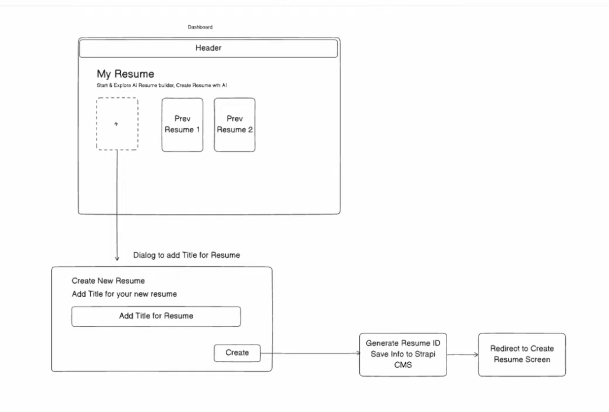

AI RESUME BUILDER

A modern app built using:

- ⚡ Vite — blazing-fast dev environment

- ⚛️ React (JavaScript)

- 🎨 TailwindCSS v4 with the official Vite plugin

- 🧩 Shadcn UI — beautiful, copy-based UI components

-  📦 app is uisng node version v25.2.0

---

## 🗂️ Project Flow Chart
```pgsql

            ┌────────────────────┐
            │   App Entry Point  │
            └─────────┬──────────┘
                      │
                      ▼
           ┌─────────────────────┐
           │ Check Authentication│
           └─────────┬──────────┘
         Authenticated? ────────────┐
          (Yes)                       (No)
            │                            │
            ▼                            ▼
  ┌──────────────────┐          ┌───────────────────┐
  │   Dashboard      │          │   Login Page      │
  │ - View resumes   │          │ - Login Form      │
  │ - Create Resume  │          │ - Signup Link     │
  │ - Update Resume  │          └─────────┬─────────┘
  └─────────┬────────┘                    │
            │                             │
            ▼                             ▼
  ┌──────────────────┐            ┌───────────────────┐
  │  Create Resume   │            │   Signup Page     │
  │ - Fill resume    │            │ - Signup Form     │
  │ - Save resume    │            └─────────┬─────────┘
  └─────────┬────────┘                      │
            │                               │
            ▼                               ▼
  ┌──────────────────┐            ┌───────────────────┐
  │  Update Resume   │◀───────────┤ After Signup/Login│
  │ - Edit fields    │            │ Redirect to       │
  │ - Save changes   │            │ Dashboard         │
  └──────────────────┘            └───────────────────┘

```
---
## 🚀 Getting Started

```bash
- npm create vite@latest Ai_Resume_Builder
```

### Install Dependencies

`npm install @tailwindcss/vite`


### Run the App

`npm run dev`

### Tailwind Setup
This project uses the new Tailwind Vite plugin (no PostCSS config needed).

✅ vite.config.js

```js

export default defineConfig({
  plugins: [react(),tailwindcss()],
  resolve: {
    alias: {
      // eslint-disable-next-line no-undef
      "@": path.resolve(__dirname, "./src")
    }
  }
})

```

✅ src/index.css

`@import "tailwindcss";`

### jsconfig.json

```js
{
  "compilerOptions": {
    "ignoreDeprecations": "6.0",
    "baseUrl": ".",
    "paths": {
      "@/*": ["src/*"]
    }
  }
}
```
### 🧩 Shadcn/ui

Run the shadcn init command to setup your project:

```bash
npx shadcn@latest init
```

- creates components.json

- configures Tailwind

- sets up import paths

- prepares your project to download components later

#### After initialization add components

for example if you want to add card component in the app.

```bash
npx shadcn-ui add card
```

### Google Authentication


### Create Dashboard

#### Add resume

